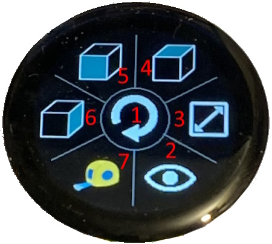
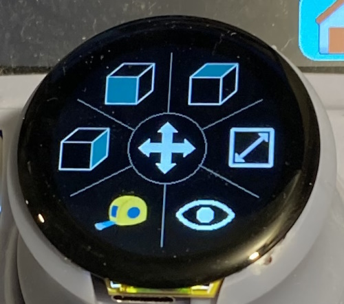

# CADDeck

This is the source repository for the software for CADDeck, a combined joystick and touch panel display suitable for use with common CAD programs.

## Hardware Configuration

### Version 1 (deprecated)

The initial version of CADDeck combined a programmable touchscreen based on Dustin Watt's [FreeDeck](https://github.com/DustinWatts/FreeTouchDeck.git) with a joystick, and with a knob on the joystick that had four buttons and a thumbwheel encoder. It connects to the PC as a HID device via Bluetooth, emulating any command that the regular keyboard and mouse can generate.

Because of the improvements in V2 no work is currently being done on this version of the hardware, but details can be found in the branch Version_1-Four_Buttons.


### Version 2 "AFUDirk" hardware

AFUDirk designed a [new case and knob](https://github.com/AFUDIrk/CADDeck). I reworked the S/W to handle this configuration. He also developed two PCB to ease assembly. It is much better overall than V1, and I have moved my own CADDeck hardware over to his version.


His version includes:

1. The same two axis joystick as V1
2. Two axis knob (up/down and rotate left/right) with a capacitive switch for mode select
3. Ten buttons
4. The same LCD touch panel as v1

The two axis joystick provides two degrees of freedom (DOF) and the knob adds two more for a total of 4DOF. The mode switch on the top of the knob switches the two joystick axis between translate and rotate modes to support a total of 6DOF.

All H/W buttons as well as the touch panel buttons are programmable through a web page.

## PC Interface

CADDeck connects to the PC via Bluetooth and shows up as HID devices (i.e. it looks like a keyboard and mouse to the PC). A USB-C port is provided for power and to download code.

## Touch Panel

The touch panel is adapted from Dustin Watt's [FreeTouchDeck project](https://github.com/DustinWatts/FreeTouchDeck.git) which I [modified](https://github.com/andrewfernie/FreeTouchDeckWT32.git) to increase the button count, etc. . For this project I added support for the joystick, encoder (v1 only), and physical buttons.  

The project, and in particular the mechanical design, assume the use of a [WT32-SC01 board](http://www.wireless-tag.com/portfolio/wt32-sc01/). The board includes an ESP32-WROVER-B module that is the "CADDeck Processor", and a 3.5" LCD with capacitive touchscreen.

Purchase the basic board, not the "Plus" version as the Plus uses a parallel interface to the LCD panel and doesn't leave enough IO lines free for the joystick and buttons, etc.

One thing to watch is that the connections to the board are via a 40 pin (2x20) header. The pins are on a 2mm pitch rather than the more common 2.54mm (0.1 inch) pîtch.

## SpaceMouse Emulation

While the basic project uses mouse/keyboard combinations for viewpoint control and button actions, a SpaceMouse Pro emulation mode is also available. This requires an external [Raspberry Pi Pico board](https://www.raspberrypi.com/documentation/microcontrollers/raspberry-pi-pico.html) running the software in the "magellan-spacemouse" folder. This is a fork from the [project of the same name by jfedor2](https://github.com/jfedor2/magellan-spacemouse) that I extended to support the full 15 buttons of the SpaceMouse Pro.

The Pico receives commands via UART (serial port) from the CADDeck WT32-SC01 board, and connects to the PC via USB. The version of ESP32 on the WT32-SC01 does not support USB HID devices, so this means that you need both the USB-C cable hooked to the PC for any commands going through the SpaceMouse emulation, and a Bluetooth connection for any other commands.

You still need to connect to the WT32-SC01 via USB to program it as well as to provide power to the overall device. Plus there is the USB connection to the Pico. To avoid needing to connect two cables a small [USB hub PCB](https://www.aliexpress.com/item/1005005623071474.html), or search for "Industrial-grade USB 2.0 expansion module HUB hub" if the link dies) is used to combine the two USB internally such that only one USB connection is required to the unit.


The SpaceMouse emulation is entirely optional, but it certainly makes CADDeck more convenient to use as up to 15 buttons can be programmed using the 3Dconnexxion configuration utility without worrying about which keystrokes are needed to perform the action. It also allows the actions to be defined for a wide range of CAD applications and switches between them automatically.

The 10 hardware buttons and any of the soft buttons on the LCD screen can activate the 15 emulated buttons.

## LCDKnob

AFUDirk's knob had a simple capacitive switch on top for translate/rotate mode selection. I then noticed small [round LCD touch panel displays](https://www.aliexpress.com/item/1005005561489118.html) available from the regular mail order stores Search for "1.28inch ESP32 round display" and you will find a few suppliers. These displays include an ESP32-C3-Mini-1U module.


They come in a few versions - with/without the touchscreen, and with/without the case. You definitely need the touchscreen version, and I found that the version with the case as seen in the picture is ideal as it includes a dark transparent cover with rounded edge that makes it easy to mount. The cover appears to be taped to the case back and I couldn't find an easy way to take it off so ended up chewing away at the case back with side cutters until I could pull the back off. I have since been told that this is how cellphone screens are held and that they are released by heating to soften the glue in the tape. However, I have not tried the heating approach.

The LCDKnob folder under the main CADDeck folder includes the software that is loaded on the ESP32-C3-Mini-1U processor. It displays seven icons on the screen, detects clicks, and sends them to the main CADDeck processor via a UART.



Button 1 at the center is used to switch between rotate


and translate modes.



The default configuration for the other six buttons includes top/front/side views, fit to window, measure, and visibility. This works best with the SpaceMouse emulation feature as the same buttons can be remapped to the appropriate CAD program functions via the 3Dconnexion configuration program, although this is not required.

The icons along with the json files that define which icon is used for which button are contained in the "CADDeck/LCDKnob/data folder"

The icons on the buttons are expected to be 64x64 png files.

The code supports the CADDeck processor commanding the LCDKnob to switch to an alternate set of icons but this feature is not currently being used.

The only part that needs to be changed in the knob assembly is the outer part that you grip (called "Rad" in AFUDirk's model) to increase the height. This image shows the original (left) knob compared to the new version (right).


An stl file for the new knob "Knob-Round LCD.stl" can be found in the "CADDeck\hardware\LCDKnob Parts" folder.

The display is held in place by friction, and I printed my part using an SLA (resin) 3D printer with higher resolution and accuracy than a typical FDM (filament) 3D printer. You may need to play with the design a bit if you are using an FDM printer.

This is a view of the new knob with the LCD display installed.


## S/W Build Notes

The main CADDeck program, the SpaceMouse emulation and LCDKnob are three different software builds targeting three different processors. CADDeck and LCDKnob use PlatformIO while the SpaceMouse emulation uses the Raspberry Pi Pico SDK with Cmake and VSCode.

### CADDeck Build

1. The build uses the PlatformIO IDE for VSCode. Install VSCode, then the PlatformIO plugin and you should be good to go.  
2. Open the main CADDeck folder in VSCode and PlatformIO should pick up the platformio.ini file that defines the build environment.
3. You need to make sure that the appropriate pins are defined for your hardware configuration. If you built according to the plans you should be good to go. If not, you will need to track down which pin definitions to change.
4. Make sure that the line "#define LCDKNOB_SUPPORT 1" in CADDeck is active if you plan to use an LCDKnob, or commented out if you just have a single switch on the knob.
5. Connect your USB cable to the connector on the CADDeck that goes to the WT32-SC01
6. Select "Upload" from the PlatformIO menu to build and load the code.
7. Select "Upload Filesystem Image" from the PlatformIO menu to upload the various configuration files and icons
8. Select "Monitor" from the PlatformIO menu to reset the system. If you check the terminal window you should see a number of messages flash by on the screen.
9. You may see build messages like

        In file included from include/CADDeck.h:14,
                 from include/SaveConfig.h:3,
                 from src/SaveConfig.cpp:1:
        .pio/libdeps/esp-wrover-kit/TFT_eSPI/TFT_eSPI.h:909:8: warning: #warning >>>>------>> TOUCH_CS pin not defined, TFT_eSPI touch functions will not be available! [-Wcpp]
        #warning >>>>------>> TOUCH_CS pin not defined, TFT_eSPI touch functions will not be available!`

    You can get rid of these by defining TOUCH_CS in platformio.ini to any unused pin that is a valid output pin. The alternative is to not define TOUCH_CS (delete the line, or put a semi-colon in front of it) and just ignore the messages.

        #define TOUCH_CS=33

10. The system tries to display the logo in "CADDeck_logo.bmp" at startup. If you don't want anything displayed make sure that the file doesn't exist. In this case you will see a message like the following on the serial port. As long as you didn't want anything displayed at startup ignore the message.

        [  1159][E][vfs_api.cpp:104] open(): /littlefs/logos/CADDeck_logo.bmp does not exist, no permits for creation

11. You may  see some error messages like

        ```[vfs_api.cpp:104] open(): /littlefs/list does not exist.``` 

    This is a known issue with ESPAsyncWebsServer related to LittleFS supporting folders while SPIFFS does not. For more information [see this site.](https://github.com/lorol/)

12. Having trouble? There are some debug messages that can be enabled in FreeTouchDeck.h

        #define LOG_MSG_BASIC 1
        #define LOG_MSG_LEVEL 1  // 1=ERROR, 2=ERROR+WARN, 3=ERROR+WARN+INFO
        #define LOG_MSG_DEBUG 0
        #define LOG_MSG_TOUCH_DEBUG 0  // messages to console each time a touch is detected

     Try setting LOG_MSG_LEVEL to 3 and you will get quite a few more status messages

### LCDKnob Build

1. Same process as for CADDeck, but start by opening the LCDKnob folder, and there is no "#define LCDKNOB_SUPPORT 1" to check.
2. Connect a USB cable to the USB connector on the round display.
3. Select "Upload" from the PlatformIO menu to build and load the code.
4. Select "Upload Filesystem Image" from the PlatformIO menu to upload the various configuration files and icons
5. Select "Monitor" from the PlatformIO menu to reset the system. If you check the terminal window you should see a number of messages flash by on the screen.

### SpaceMouse Code

The SpaceMouse build is easy enough once the build environment is set, but it took me a couple of tries to get that right. So, you have two options.

1. Install the build environment and build from scratch.
2. Use the pre-build binary magellan.uf2 in the **CADDeck\magellan-spacemouse** folder

Unless you really need to make some changes, go for option 2.

#### Full build

1. Open the [Raspberry Pi Pico site](https://www.raspberrypi.com/documentation/microcontrollers/raspberry-pi-pico.html) and download the "Getting started with Raspberry Pi Pico" document.
2. Download the "Raspberry Pi Pico C/C++ SDK" from the same page.
3. Follow the instructions in the "Building on MS Windows" section of the "Getting started" document (or the section for your preferred OS)
4. Open VSCode using the shortcut **Pico - Visual Studio Code** that was created when you installed the SDK
5. Open the **CADDeck\magellan-spacemouse** folder
6. Build through the CMake plugin that was installed along with the SDK

It took me a few tries to get this working so just use the pre-built binary :).

#### Use Pre-built Binary

1. Connect your Pico to your PC via USB while holding down the "BOOTSEL" button. The Pico should show up as a flash drive.
2. Drag and drop the pre-built magellan.uf2 to the root of the flash drive
3. You are done

# Setup

Once the unit is assembled and the display is coming up you should see the main page.


Go to the CAD Settings page.


Then the Switch Monitor page.


It displays the status of the joystick, encoder, and buttons. You should be able to see the result of each joystick movement or button selection. Note that the values are shown as 1 when not selected and 0 when selected (pushed).

The joystick X and Y data may be bouncing around a bit. This is normal as the joystick is not calibrated at this point. To calibrate the joystick:

1. Go back to the CAD Settings page
2. Press the Joystick Zero button when the joystick is centered and still. This sets the zero point for the joystick.
3. Press the Joystick Scale button and move the joystick around to the extremes in X and Y. You have 5s. Once the function finishes the calibration parameters will be calculated and the joystick should show a range of roughly +/- 1 in both X and Y.
4. If you are happy with the calibration, press the Save CAD Configuration button and the parameters will be saved to the cadparams.json file in the ESP32. This file can be downloaded from the ESP32 to your PC via the CAD Settings page in the configurator. It is a good idea to do this and to copy the file to the data\config folder in the CADDeck code so that you won't lose the parameters next time you upload the data folder to the ESP32.
5. If you are not happy with the results, try again.

Bind your computer to the CADDeck using the Bluetooth settings page on your computer.

# Configuration

Note that all of the pages shown or mentioned above are samples. Every page can be reorganized and customized to suit your needs via the configurator.

## WiFi Configuration

The configurator is accessed via a web browser on a computer or tablet connected to the same network as the ESP32. To enable the configurator go to the settings page on the touch panel and select the WiFi Enable button.  


If you have already configured your wifi connection in wificonfig.json you should see a message saying that it has connected to the wifi and will display the IP address. At that point you can go to your browser and enter the IP address top connect. The configurator will be displayed.


If you have not already configured the wifi you should see a message saying that an access point (AP) has been created with a network name and IP address. You will need to connect your computer to the network provided, and then point your browser at the IP address. Once the configurator screen is displayed in your browser go to the wifi page and enter your network SSID and password. Then select "Save WiFi Config" to save the settings.

## Menu Configuration

The main change from the original FreeTouchDeck is to allow more buttons per page  - the screen area is just a bit smaller than the size of twelve StreamDeck buttons which seems reasonable. The code is currently set to three rows of four buttons, but can be changed to three rows of five buttons (or two rows of four, etc.) by modifying CADDeck.h: "#define BUTTON_ROWS 3" and "#define BUTTON_COLS 5".  In principle it should support larger arrays, but not tested, and the configurator page is set to a maximum of 3x5.

The configurator displays an array of three rows of five buttons, with a drop down list to select the menu page to be modified. If you are using fewer than 3x5, simply ignore the extra rows and columns. On the to-do list is to generate the HTML dynamically to correspond with the number of rows and columns.


Each Menu page has a 2D array of programmable buttons, and each button has an array of 3 actions that can be defined for when the button is pressed.

You can set different background colors for a button that performs an action (black background in the image above), or links to another menu (light blue in the image.) This is controlled on the Settings page of the configurator.

If you don't want to use all buttons use the configurator to set the logo to "blank.bmp" and make sure that there are no actions defined for that button. Any button with those characteristics will not be drawn.

One limitation is the size of the FLASH used for the configuration files and icons displayed on the touch screen. The icons are 75x75 24-bit color BMP files, each one taking about 17kB.  If you run out of space your only option is to check to see if any are unused and delete them.

## Hardware Buttons

Configuration of the hardware buttons is via a dedicated page within the same web-based configurator as for the LCD panel.


The top section includes:

1. Current CAD program: This is the program whose settings will be loaded when the CADDeck is restarted
2. X and Y scaling parameters for the joystick. These can be set manually, but a function is provided to capture data as the joystick is moved to its extremes and calculate the scalings for you. The output scaling is +/-1
3. Joystick deadzone. Any X or Y value with an absolute value below this number is set to zero.
4. Joystick sensitivity. Joystick values are multiplied by this as they are converted to mouse movement commands
5. Thumbwheel sensitivity. The encoder value is multiplied by this as it is converted to mouse movement commands

Below that is the button action definition. The same approach to defining the actions is used as for the LCD panel buttons. The actions are:

1. Selected CAD program. The program whose settings are being modified in that part of the configurator. Separate definitions of these settings are kept for each of the five CAD programs available.
2. Selected Button. One of the nine buttons shown in the image to the left. Click  one of the indicated areas in the image then modify the actions for that button as needed.
3. The actions that must be taken to enable pan/rotate/zoom to be controlled by the joystick (i.e. the mouse) within the selected CAD program. Note that the definition of what is needed to control pan/rotate/zoom is separate from which button enables that mode. As an example, Solidworks needs the middle mouse button to be held down to rotate the view. So, JoystickRotate/Action1 is set to "Mouse Buttons" and Value1 is set to "Press Middle Button". To assign the Rotate function to button 8, click "8" in the image to the left, then set SelectedButton/Action1 to "CAD Functions" and Value1 to "Joystick Rotate"


At the very bottom is the "Save CAD Config" button. When selected the settings for all CAD programs are saved on the ESP32 in file cadparams.json
